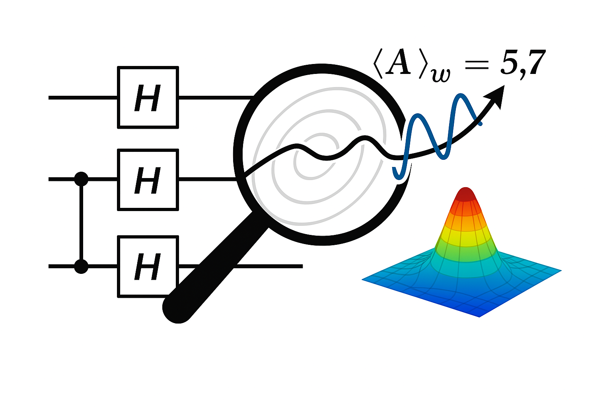

<p align="center">
  
  <br/>
  <strong>NeuroGlyph: Language for Contextual & Relational Thought</strong>
</p>


# 🔬 Weak Value Simulation: Pure and Mixed States

This repository accompanies the article:

**When the Weak Becomes Strong: Effective Observables via Time-Symmetric Quantum Selection**  
by Mirco A. Mannucci  
📄 [Read the article here](https://www.academia.edu/136857825/When_the_Weak_Becomes_Strong_Effective_Observables_via_Time_Symmetric_Quantum_Selection?%E2%80%9D=) ← 

---

## 📓 Overview

This project provides a verified Jupyter Notebook implementing and testing the central identities presented in the paper, using Qiskit simulations.

We verify:
1. For pure states:  
   $$ \langle \phi | A P_\psi A | \phi \rangle = | \langle \phi | A | \psi \rangle |^2 $$
2. For mixed states:  
   $$ \langle \phi | A \rho A | \phi \rangle = \sum_k p_k | \langle \phi | A | \psi_k \rangle |^2 $$

These expressions validate the notion of an **effective observable** arising from bidirectional weak values.

---

## 🚀 How to Run

1. Clone the repository:
   ```bash
   git clone https://github.com/your-username/weak-value-simulation.git
   cd weak-value-simulation
   ```

2. Open the notebook:
   ```
   weak_value_simulation.ipynb
   ```

3. Install required packages (if needed):
   ```bash
   pip install qiskit qiskit-aer
   ```

4. Run all cells to reproduce the simulations and verify theoretical results.

---

## 🧠 Dependencies
- Python ≥ 3.8
- Qiskit ≥ 0.36
- Jupyter Notebook or Lab

---

## 📜 License

This project is released under the MIT License. Feel free to reuse with attribution.

---

## 🧠 Author

**Mirco A. Mannucci**  
[https://holomathics.com](https://holomathics.com)
